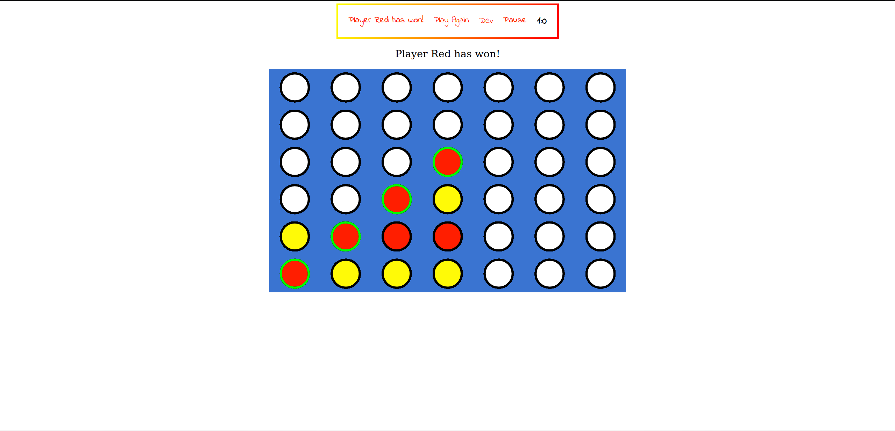

# Connect 4 JS

This is a Javascript vanilla implementation of the classic game connect 4.

It works entirely on Javascript and utilizies HTML5 Apis such as Canvas.

It has no dependencies other than snowpack to bundle the files together for development purposes.

## Features

It has canvas hover support to

# Gameplay

## How to run locally

To test the development version of this project clone the repoistory and then run the following on it.

`npm install` in the root directory

Once you have installed the dependencies by running the command above you can run a development version by running the following.

`npm start`

This project uses snowpack as the development server.